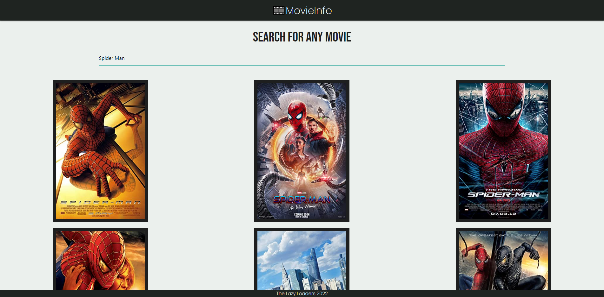
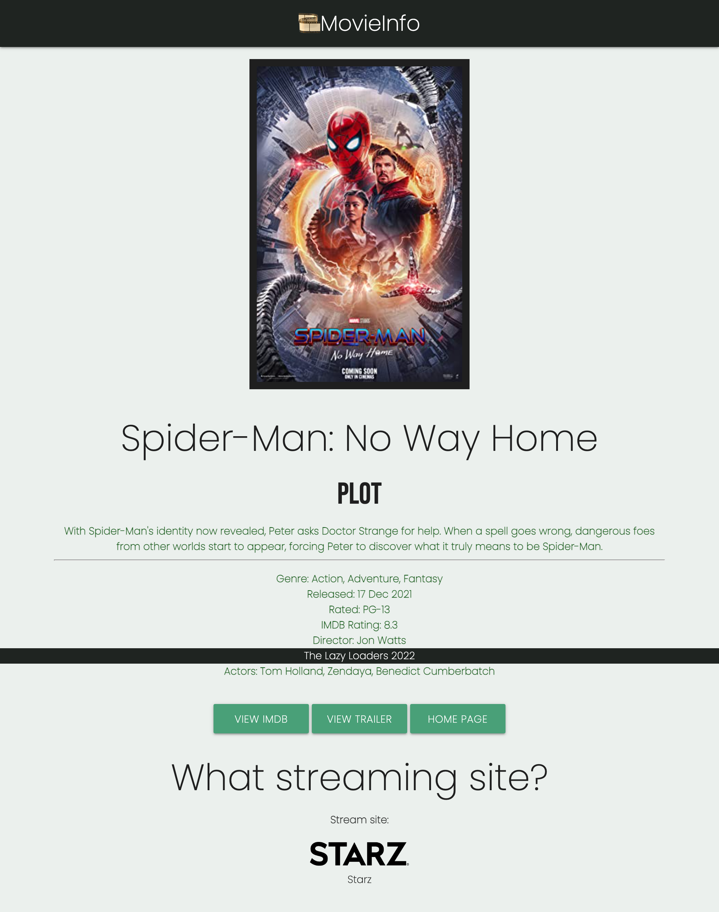

# Movie-Search

For this project, we were tasked in making an application that uses at least two server-side APIs, use a CSS framework other than Bootstrap, use client-side storage to store persistant data, have a polished UI, have good quality coding standards, not use alerts, confirms, or prompts, deployed to GitHub Pages, and be interactive.

We decided to make an application that will allow the user to search for a movie, get the details of such movie and see if and where the movie is streaming online.

We used two server-side APIs, The Open Movie Database (OMDB) API and Streaming Availability API. The OMDB API was used to retrieve the movie information, such as the movie title, poster,  release date, genre, director and cast. Streaming Availability was used to retrieve the information of if the movie is streaming and on which stream site, if applicable.

The CSS framework used in this application is materializecss. 

USER STORY

AS A user 
I WANT to to find the information of a movie and know where it is streaming online 
So THAT I can easily watch it


```Given a movie search app
WHEN the user searches a movie
THEN a list of movies is displayed
WHEN the user hovers over the poster
THEN the title is displayed along with a "MOVIE DETAILS" button
WHEN the button is clicked
THEN a second page with the movie details along with which streaming service is displayed
WHEN the user clicks on "VIEW IMDB" button 
THEN the user will be taken to the movie's IMDB page
WHEN the "VIEW TRAILER" button is clicked
THEN the user will be taken to the trailer video on youtube
WHEN the user clicks on the "HOME PAGE" button
THEN the user will be taken back to the initial page```


## Project Requirements

*Use a CSS framework other than Bootstrap.

*Be deployed to GitHub Pages.

*Be interactive (i.e: accept and respond to user input).

*Use at least two server-side APIs.

*Does not use alerts, confirms, or prompts (use modals).

*Use client-side storage to store persistent data.

*Be responsive.

*Have a polished UI.

*Have a clean repository that meets quality coding standards (file structure, naming conventions, follows best practices for class/id-naming conventions, indentation, quality comments, etc.).

*Have a quality README (with unique name, description, technologies used, screenshot, and link to deployed application).


## Work Completed

*Creates HTML that responds to JavaScript

*Adds project name to title

*Uses fetch functions to pull 2 API's

*Gets user input and creates movie list based on the value

*Stores movie's id in session storage

*Responsive Navigation Bar

*Adds comments to describe JavaScript

*Uses movieId from sessionstorage to access API's

*Creates an if /else statement to see which streaming service

*Uses values in API to assign values

*Makes the website responsive to different viewports

## Deployed Site

The deployed site hosted by GitHub.

https://scottwatt.github.io/Movie_Search


## Screenshot

### Full page



